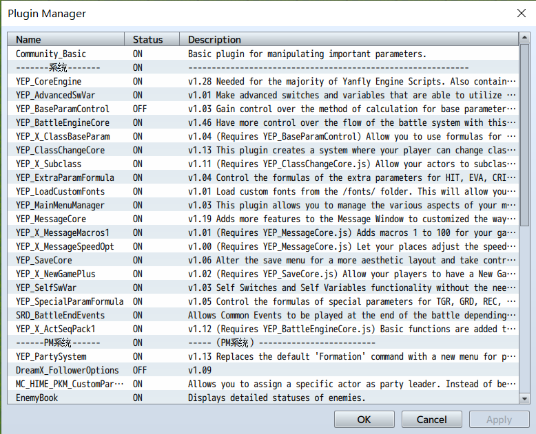
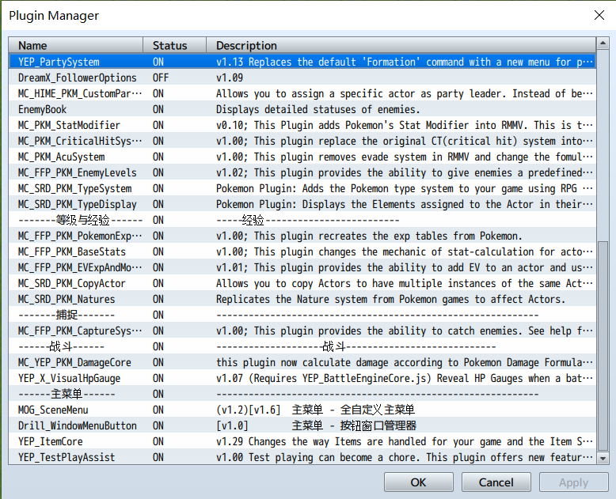

# 精灵宝可梦同人计划

这个项目是使用RPG Maker MV制作一个尽可能还原Pokemon的同人游戏

在未特殊说明的前提下，所有规则默认遵循宝可梦第五世代的规则

## 项目目前状态

### 人物显示

目前可以实现显示人物的角色，而不是领队的精灵（利用了MC_HIME_PKM_CustomPartyLeader.js和角色旁边的一个公共事件）

### 数值系统

#### 等级和经验

1. 等级可以正确影响能力值
2. 等级可以正确影响打败敌人获得的经验
3. 宝可梦的经验曲线（每升一级所需要的经验）已经被实现

#### 能力值

1. 能力值可以被正确计算

#### 种族值

1. 可以通过角色的属性面板，创造一个不变的属性曲线来设定种族值

#### 个体值

1. 个体值可以被正确地随机分配并影响能力值

#### 努力值

1. 努力值可以通过标签，击败敌人获得
2. 努力值可以正确影响能力值

#### 性格

1. 性格可以影响能力值

#### 属性

1. 宝可梦的属性系统已经实现，可以正确地显示并且在战斗中结算伤害

### 战斗系统

绝大部分的更新在战斗系统上，目前实现的功能有：

1. 宝可梦的技能伤害可以正确地根据属性、能力值、能力等级变化、会心一击进行计算
2. 1v1战斗中的能力变化功能已经实现，可以使用技能和物品改变一项属性的能力等级变化。这包括六项基本属性和命中、会心率。
3. 命中和会心可以正确地因能力等级而发生变化
4. 会心一击系统已经被更改，目前可以正确地结算会心一击的概率和伤害

### 捕捉系统

1. 捕捉系统可以依概率捕捉宝可梦，但是没有任何其他结算，如图鉴记录

## 插件使用说明

### 插件引用顺序

该项目所提供的插件顺序可以保证所描述的功能正确实现，但是并不能保证其中没有错误。

所有经过修改的插件都已经以MC_开头命名，一般来说，除了这些插件以及YEP开头的插件都可以随便更改其顺序。如果出了问题请及时联系作者。

这里仅列出一些有必须依赖先后顺序的情况：

1. `MC_YEP_PKM_DamageCore.js` 需要在 `YEP_BattleEngineCore.js`, `MC_SRD_PKM_TypeSystem.js`, `MC_FFP_PKM_EnemyLevels.js`，`MC_PKM_StatModifier.js`以下。实现战斗结算功能。推荐放在所有MC_文件的最后面。
2. `MC_SRD_PKM_Natures.js` 必须在 `MC_SRD_PKM_CopyActor.js`, `MC_FFP_PKM_BaseStats.js` 以下。实现性格功能
3. `MC_PKM_StatModifier.js` 必须在 `MC_PKM_AcuSystem.js` 和 `MC_PKM_CriticalHitSystem.js` **之上**。实现能力等级变化功能。
4. `MC_FFP_PKM_BaseStats.js` 需要在 `MC_FFP_PKM_EnemyLevels.js` 以下，并且必须启用`MC_FFP_PKM_CaptureSystem.js`。实现能力值的计算、启用敌人的等级和战斗结算努力值、经验和金钱。
5. `MC_SRD_PKM_TypeDisplay.js` 必须在 `MC_SRD_PKM_TypeSystem.js` 以下。实现属性系统。

如果有任何问题，首先可参看插件的说明，如果无法解决再联系作者

### 使用插件一览

如果顺序和文档描述有矛盾，以图片中的顺序为准。

## 已知错误

1. 捕捉到的精灵在队伍中的顺序可能存在问题。这与程序中对队伍中成员的顺序调整有关
2. 目前战斗后因为没有使用战斗后事件，对战双方的能力变化是不会清零的
3. 战斗时有对战动画的播放错误，这可能是战斗流程结算中的问题

## 作者联系方式

微信：simon456sin30
邮箱：ma-c17@mails.tsinghua.edu.cn
